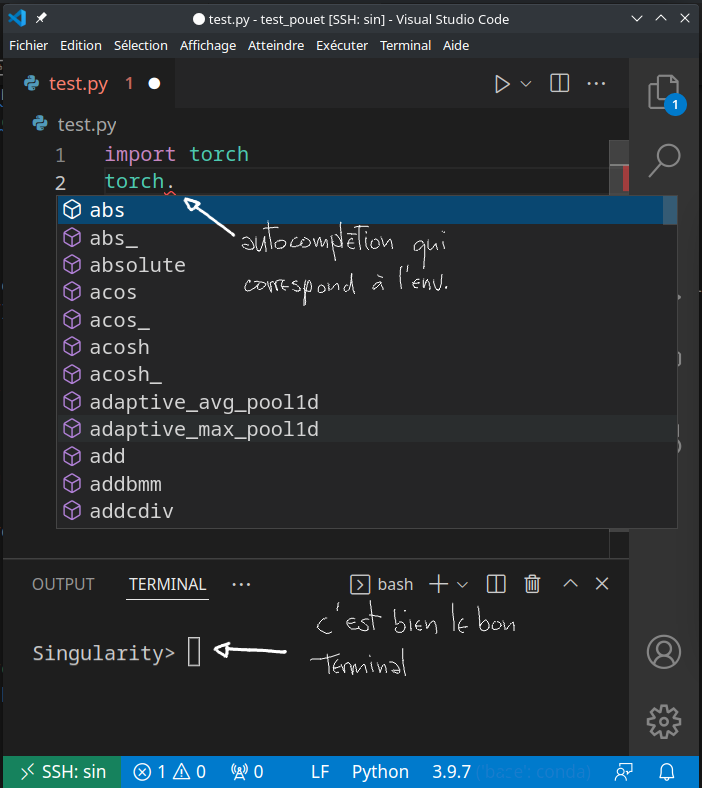

# Singularity

Singularity peut être vu comme le "docker du calcul". Il résout tous les problèmes d'environnement et permettant, sans les droit root, de définir un système complet qui vient se raccorder sur le noyau en cours.

Les "images" (qui définissent ce sur-système) peuvent par ailleurs être copiées et utilisées à l'identique sur le cluster comme sur sa machine personnelle. Ça permet d'utiliser les mêmes environnements, interpréteurs et compilateurs sur votre machine et sur le cluster.

Par ailleurs, il existe une quantité énorme d'images déjà prêtes, proposées par des entreprises ou la communauté. Singularity permet en particulier de charger des images docker, comme celles - très nombreuses - que vous pouvez trouver sur [dockerhub](https://hub.docker.com/). Vous pourrez aussi trouver un certain nombre d'images sur [cloud.sylabs.io](https://cloud.sylabs.io/library/) (plus orienté calcul, mais dockerhub n'est pas en reste).

## Installation

Singularity est disponible sur le cluster via un module. Pour l'activer, vous pouvez taper

```bash
module load Singularity
```

C'est ce n'est pas déjà fait, vous pouvez aussi [l'installer sur votre machine](https://sylabs.io/guides/3.0/user-guide/installation.html) (et c'est conseillé pour tester et préparer de façon simple).

## Récupération d'une image déjà prête

Pour charger une image déjà préparée, on utilise la commande `pull` :

```bash
# on fait un exemple avec la librairie fenics qui est
# notoirement difficile à installer par d'autres biais
singularity pull docker://pymor/fenics_py3.8
```

Cette commande crée un fichier `.sif`, qui contient toutes les données de l'image. On peut copier et utiliser ce fichier où on veut (y compris en dehors du cluster), pourvu qu'on soit sur le même type d'architecture de base (x86, arm, ...).

## Utilisation du fichier `.sif`

### Shell interactif

Il est possible de lancer un shell interactif, comme dans :

```bash
singularity shell fenics_py3.8_latest.sif
# > ... vous pouvez taper n'importe quelle commande du shell choisi
```

### Liens vers les répertoires de l'hôte

Singularity met automatiquement en place un lien vers votre $HOME, en plus du répertoire dans lequel la commande est lancée.

Si ce n'est pas suffisant, vous pouvez ajouter des liens vers d'autres répertoire de l'hôte avec l'option `--bind`, comme dans

```bash
singularity shell --bind /workdir/<login> fenics_py3.8_latest.sif
# > ls /workdir/<login> vous donnera bien le contenu de votre workdir
```

### Exécution de programme

On peut demander l'exécution directe un programme avec `exec` :

```bash
singularity exec fenics_py3.8_latest.sif python ft01_poisson.py
```

Par ailleurs, si l'image contient un exécutable à lancer par défaut, vous pouvez utiliser `run` :

```bash
singularity pull docker://sylabsio/lolcow
singularity run lolcow_latest.sif 
 _______________________________
< Fri Apr 22 07:25:20 CEST 2022 >
 -------------------------------
        \   ^__^
         \  (oo)\_______
            (__)\       )\/\
                ||----w |
                ||     ||
```

## GPU

Pour donner accès aux GPUs, il suffit d'ajouter `--nv` aux options de lancement (`run`, `shell`, ...) comme dans :

```bash
singularity pull docker://bitnami/pytorch
# on lance nvidia-smi sur le noeud 15, dans l'environnement pytorch_latest.sif
srun -w node15 singularity exec --nv pytorch_latest.sif nvidia-smi
```

## MPI

Singularity s'occupe automatiquement de transférer les variables d'environnement nécessaire au fonctionnement de mpi. Pensez simplement à ajouter `--mpi=pmi2` dans les flags de `srun`, comme dans :

```bash
srun -n2 --mpi=pmi2 singularity exec mpi4py_latest.sif python test_mpi.py
```

## Accès par ssh, configuration des IDEs

Vous pouvez enregistrer l'environnement comme une machine sur laquelle se connecter avec ssh en ajoutant un `RemoteCommand` dans votre `.ssh/config` :

```bash
Host <mon_env>
    # ProxyJump <cinaps_ou_autre> si c'est à lancer sur une autre machine
    RemoteCommand singularity shell <mon_image.sif>
    HostName localhost
    RequestTTY yes
```

Après ça vous pourrez entre autres y développer à distance avec l'aide de votre IDE favori.

Pour visual code cependant, il faudra penser à ajouter `"remote.SSH.enableRemoteCommand": true` dans `settings.json` (accessible via `ctrl-shift-p` puis `Open settings (JSON)`). Après ça, vous pouvez lancer la commande `Remote-SSH: connect to host` pour vous connecter à `<mon_env>`. Vous aurez ensuite accès à l'autocomplétion qui correspond à votre environnement.



## Modification du contenu des images

Par défaut, les fichiers du système géré par Singularity sont en lecture seule.

Une possibilité pour changer ces fichiers est de passer par un "bac à sable" : les fichiers du système seront stockés dans un répertoire modifiable par Singularity.

```bash
# pour charger une image, on passe par build à la place de pull
singularity build --sandbox lolcow/ library://sylabs-jms/testing/lolcow
# on ajoute le flag --writable à shell, run ou exec
singularity shell --writable lolcow_latest.sif
# => on peut faire un `apt install` ou autre
```

## Définition d'une nouvelle image

Pour définir le contenu d'un fichier `.sif`, Singularity propose son propre format.

Vous n'aurez pas besoin d'être root pour construire une image. Cependant, il faut que le fichier `/etc/setbuid` soit défini pour vous, ce qui n'est pas le cas par défaut pour tous les systèmes. Si vous rencontrez un problème à ce sujet là, n'hésitez pas à nous contacter.

Voici un exemple de fichier de définition d'image

```bash
# test.def
Bootstrap: library # ou "docker" par exemple si vous prenez l'image de base dans dockerhub
From: ubuntu:21.04
Stage: build

%post
    # un exemple où on charge quelques paquets
    apt-get -y update 
    apt-get -y install software-properties-common 
    add-apt-repository -y universe 
    apt-get -y update 
    apt-get -y install gcc libopenmpi-dev

%runscript
    echo "Container was created $NOW"
    echo "Arguments received: $*"
```

On peut la compiler avec :

```bash
singularity build --fakeroot test.sif test.def
```

et utiliser le `.sif` résultant comme les autres `.sif`.

Vous trouverez une description plus détaillée dans [cette page](https://sylabs.io/guides/3.5/user-guide/definition_files.html).
